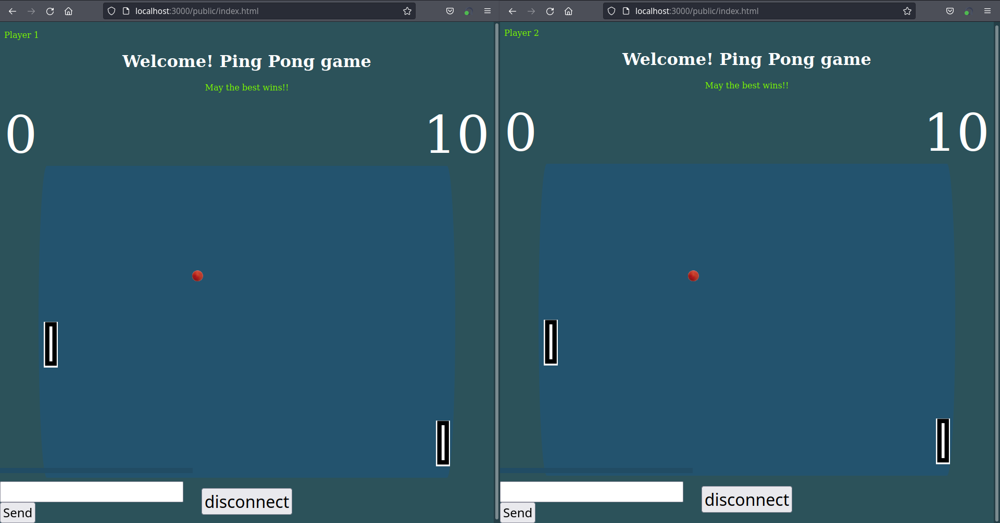
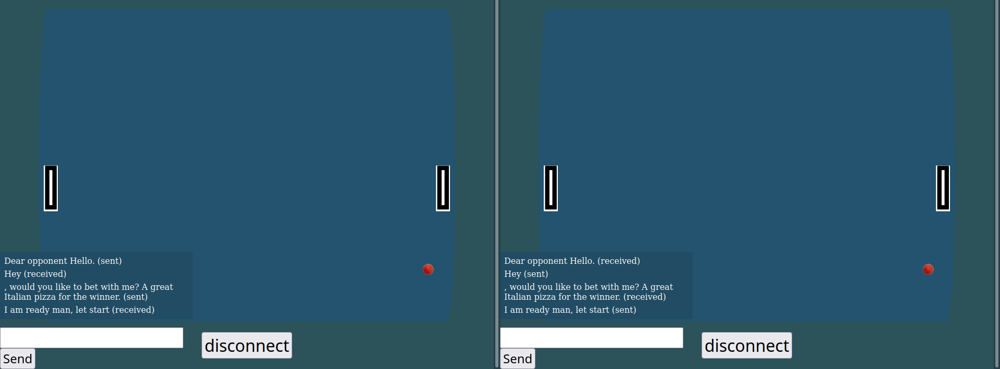
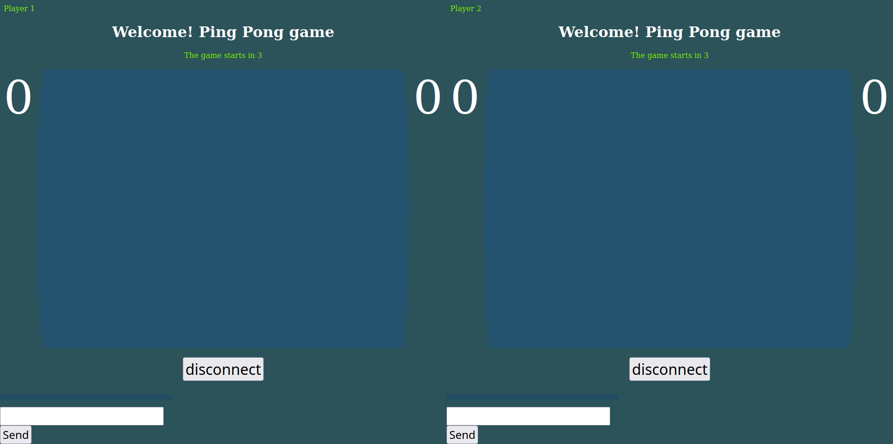
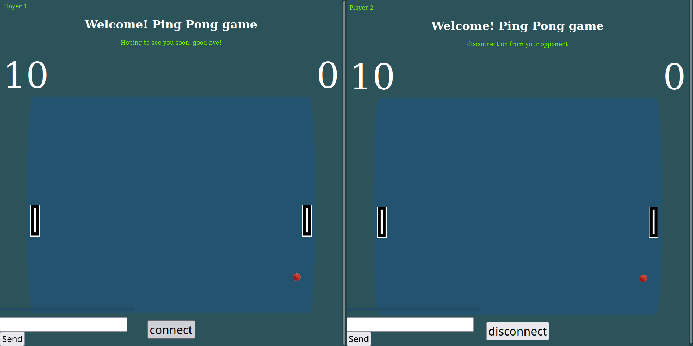

*****
<h1 style="text-align: center">
    VERSION RESEAU DU JEU PONG
</h1>

## Authors

- Abdoulkader MOUSSA MOHAMED
- Aboubacar DIAWARA

## Table of content
* [Users](#Users)
  * [Gamers](#Gamers)
  * [Developer](#Developer)
* [Additionnal Information](#Others)

## Users <a id="Users"></a>
### Prerequisite <a id="prerequisite"></a>
To run the game, you should have:
- [npm](): the game has been developed with the version `8.5.1`
- [node js](): We used the `v17.3.0`
- `A web navigator` client (example: firefox, google chrome ...)
- [git](): optional. This program is useful for cloning the repository. You can manually 
download the project.

Ensure these previous program are ready on you machine. Then read the next sections.

### Gamers <a id="Gamer"></a>
#### Step 1: go to the server folder
```shell
$ cd server/
```
### Step 2: install the dependencies
```shell
$ npm install
```
#### Step 3: run the server
To run the server, you can:
- use nodemon
```shell
$ nodemon
```
- use node js
```shell
$ node main.js
```

> You can notice in your console a litlle description which indicated on which port your 
> server is runing.
> > Example:
> > > node main.js  
> > > server running on port 3000 <<<

### step 3: run the game
You can use a web brower to open the game address:
> http://localhost:`<port>`/public/index.html
> > if port is 3000, the link will look like
> 
> http://localhost:3000/public/index.html

### Developer <a id="Developer"></a>

## Others <a id="Others"></a>
### Folder hierarchies
```bash
# project folders hierarchie
.
├── assets
├── client
│   └── src
│       ├── images
│       ├── scripts
│       └── style
└── server
    ├── controllers
    ├── public
    │   ├── images
    │   ├── scripts
    │   └── style
    └── scripts
```
# Feature

## `Discussion area`

At the bottom of the page, we can find a discussion area between the 2 players. 



## `Game start`

Once 2 players are connected, a timer is displayed on page. After that the game starts.



## `Disconnection`

When a player want to leave the game, he receive from the server a good bye notification and his oppenent is notified .

Example: Player 1 left the game.

